# **Integrating Sigfox Devices with AWS IoT core for downlink communication**

### Version 0.0.3

---

This reference architecture provides a set of YAML templates for deploying Sigfox downlink integration with AWS using [AWS CloudFormation](http://docs.aws.amazon.com/AWSCloudFormation/latest/UserGuide/Welcome.html).


## Overview

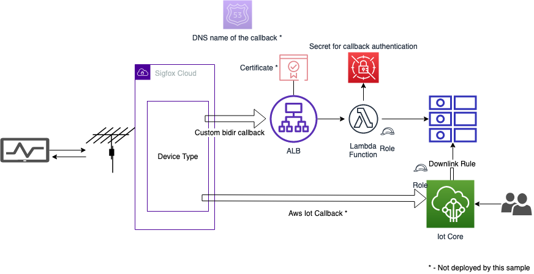

The repository consists of a master template. Run the master template to create the entire stack, entering the appropriate parameters.

## Update

Please refer to [history.md](/history.md) for a detailed list of changes.

## Steps to Run
To launch the entire stack and deploy a Sigfox Callback API for downlink messages on AWS, download the [Master template](/template/aws-sigfox-master.yaml) and launch a stack with it in Cloudformation.


#### Optional: Amazon Certificate Manager SSL/TLS Certificates

AWS Certificate Manager (ACM) is a service that lets you easily provision, manage, and deploy Secure Sockets Layer/Transport Layer Security (SSL/TLS) certificates for use with AWS services. SSL/TLS certificates provisioned through AWS Certificate Manager are free.

If you don't already have an SSL/TLS certificate for your domain name, it is recommended that you request one using ACM. For more information about requesting an SSL/TLS certificate using ACM, please read the [AWS Certificate Manager User Guide](http://docs.aws.amazon.com/acm/latest/userguide/acm-overview.html).

Use ACM to request a certificate or import a certificate into ACM. To use an ACM certificate with CloudFront (optional input parameter), you must request or import the certificate in the US East (N. Virginia) region. To use an ACM certificate with Amazon ELB - Application Load Balancer (optional input parameter), you must request or import the certificate in the region you create the CloudFormation stack. After you validate ownership of the domain names in your certificate, ACM provisions the certificate. Use the ACM certificate Amazon Resource Name (ARN) as the optional Cloudfront and/or Public ALB ACM certificate input parameters of the master template.

If you don't provide an ACM certificate at Stack deployment, the Callback will be deployed as HTTP rather than HTTPS.

#### Sigfox configuration
Once you have deployed this stack you need to configure the Sigfox backend to call the endpoint.

##### Step 1 - Log on to the Sigfox console
https://backend.sigfox.com
[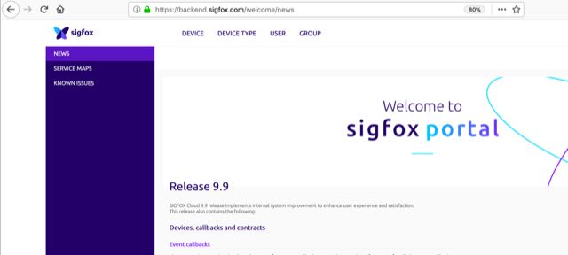](images/sigfoxstep1.png)


##### Step 2 - Navigate to the Device types page
[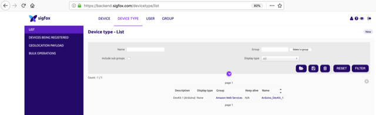](images/sigfoxstep2.png)

##### Step 3 - Click on the name of the Device type you want to add a callback to
[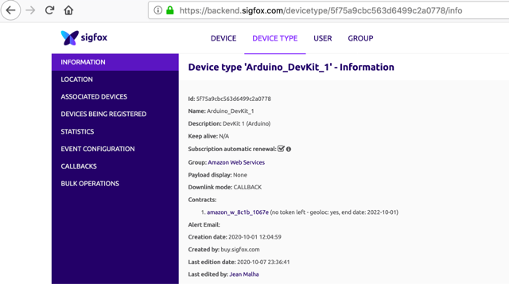](images/sigfoxstep3.png)

##### Step 4 - Click on Callbacks in the left navigation panel
[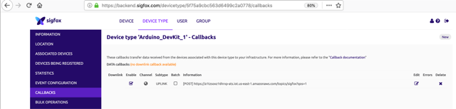](images/sigfoxstep4.png)

##### Step 5 - Click on new on the top right corner
[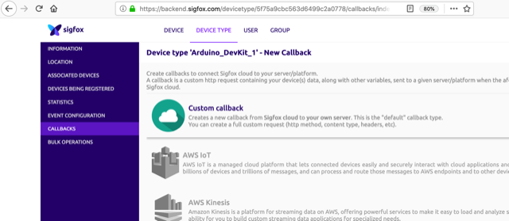](images/sigfoxstep5.png)

##### Step 6 - Click on new on the top right corner
[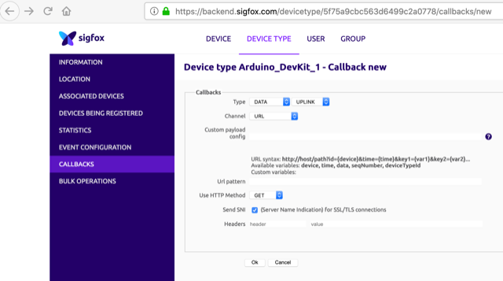](images/sigfoxstep6.png)

##### Step 7 - Configure the callback
Type DATA Bidir

URL Pattern is the output of the Cloudformation stack you have run earlier.
***Caution : Sigfox does not check the DNS name against your certificate attributes if you are using HTTPS, however the URL should be the one that is configured within your certificate and the output of the CF template should be used as a target for a DNS CNAME entry of the name you use in the certificate for a fully valid HTTPS session. ***

**HTTP Method :** Post

Add an Authorization header with the value from the output of your Cloudformation Stack.

**Content Type :** application/JSON

Body :
```json
{
	"id":"{device}"
}
```

[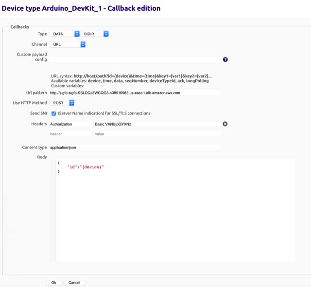](images/sigfoxstep7.png)

Click on OK to create the callback.

##### Step 8 - Make sure you activate the Downlink by clicking on the radio button on the left. A popup will ask for confirmation

[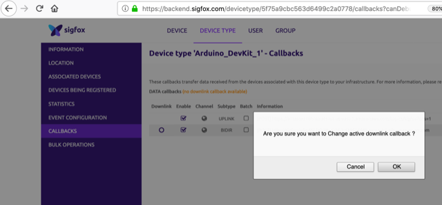](images/sigfoxstep8.png)

Confirm, the message indicating that Downlink callbacks are inactive will disapear:

[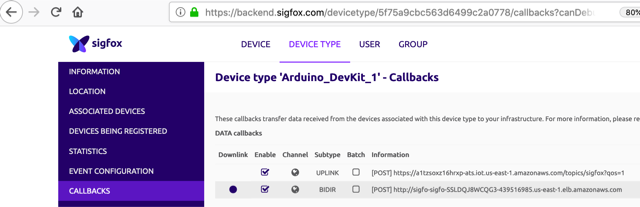](images/sigfoxstep9.png)


##### Step 9 - Go back to the Device Type screen

[](images/sigfoxstep3.png)

##### Step 10 - Click on the edit button on the top right corner

[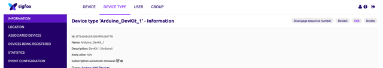](images/sigfoxstep10.png)

Make sure the Downlink Mode is configured as Callback:

[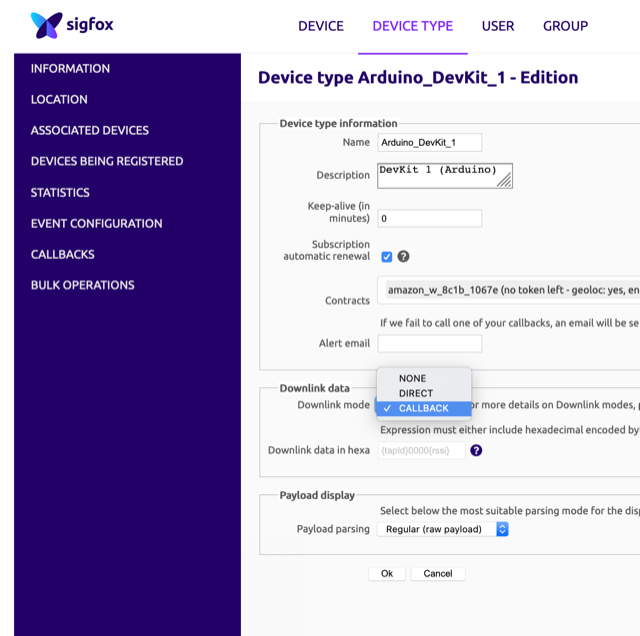](images/sigfoxstep11.png)

**Your Downlink callback is active!**

## How to send a message to a specific device using the callback
Simply write a MQTT message to the topic configured in the stack with a 'downlinkData' attribute containing the 8 bits of data to be provided to the message.
ex (if you kept the stack default values):

[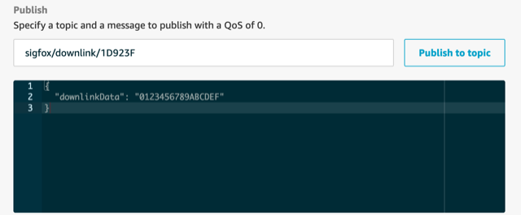](images/sigfoxdownlinkmqtt.png)

The message will be provided to the message at the next transmission:

[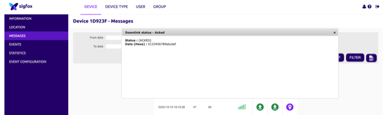](images/sigfoxdownlinkmqttresult.png)

## Master Template
The master template receives all input parameters and passes them to the appropriate nested template which are executed in order based on conditions and dependencies.
Review the template here [aws-sigfox-master.yaml](templates/aws-sigfox-master.yaml)

### AWS Resources Created:
| Resource   | Type |
| -------- | ----------- |
| sigfoxDownlinkAlb	 | AWS::ElasticLoadBalancingV2::LoadBalancer |
| sigfoxDownlinkSecurityGroup | AWS::EC2::SecurityGroup |
| sigfoxDownlinkTargetGroup | AWS::ElasticLoadBalancingV2::TargetGroup |
| sigfoxDownlinkHttpListener | AWS::ElasticLoadBalancingV2::Listener |
| sigfoxDownlinkDynamodb | AWS::DynamoDB::Table	|
| sigfoxDownlinkLambda | AWS::Lambda::Function |
| sigfoxDownlinkLambdaPermission | AWS::Lambda::Permission |
| sigfoxDownlinkLambdaRole | AWS::IAM::Role |
| sigfoxDownlinkIoTRole | AWS::IAM::Role |
| sigfoxDownlinkRule | AWS::IoT::TopicRule |
| sigfoxCallbackSecret | AWS::SecretsManager::Secret |


### Input Parameters

#### General AWS
```yaml
Subnets:
  Type: 'List<AWS::EC2::Subnet::Id>'
  Description: 'Public Subnets where the ALB will be deployed.'
VpcId:
  Type: 'AWS::EC2::VPC::Id'
  Description: 'VPC containing the Public subnets'
Certificate:
  Type: String
  Description: 'ARN of the certificate to be used for HTTPS configuration of the ALB (Leave blank for HTTP deployment).'
	Default: ''
```

#### Sigfox specific
```yaml
SigfoxUsername:
  Type: String
  Description: 'Username for the Sigfox callback authentication (Use any value an Basic Authentication header will be generated and provided to you in output).'
SigfoxPassword:
  Type: String
  Description: 'Password for the Sigfox callback authentication (Use any value an Basic Authentication header will be generated and provided to you in output).'
  NoEcho: true
SigfoxTopic:
  Type: String
  Description: 'Topic used to communicate to the Sigfox devices.'
  Default: 'sigfox/downlink/+'
SigfoxDownlinkFieldName:
  Type: String
  Description: 'Name of the field that will contain the downlinkData.'
  Default: 'downlinkData'
SigfoxDeviceId:
  Type: String
  Description: 'SQL function or message attribute used map the Device ID.'
  Default: 'topic(3)'
SigfoxSourceIP:
  Type: String
  Description: 'Source IP of the Sigfox backend.'
  Default: '185.110.96.0/22'
```

### Outputs
```yaml
URL:
# Url to be configured in sigfox backend.
  Value: !If
    - NoSSL
    - 'Fn::Join':
      - ''
      - - 'http://'
        - !GetAtt sigfoxDownlinkAlb.DNSName
    - 'Fn::Join':
      - ''
      - - 'https://'
        - !GetAtt sigfoxDownlinkAlb.DNSName

AuthenticationHeader:
# Authentication Header to be configured in sigfox backend.
  Value:
    'Fn::Join':
      - ' '
      - - 'Basic '
        - !Base64
          'Fn::Join':
            - ''
            - - !Ref SigfoxUsername
              - ':'
              - !Ref SigfoxPassword

```

## Security

See [CONTRIBUTING](CONTRIBUTING.md#security-issue-notifications) for more information.

## License

This library is licensed under the MIT-0 License. See the LICENSE file.
